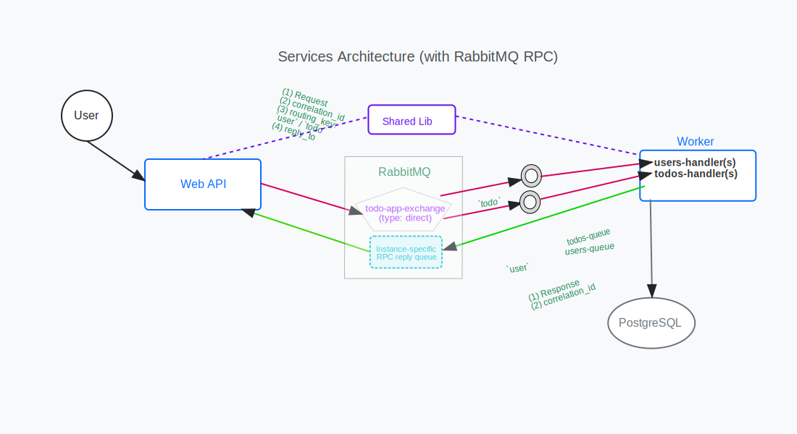

# Todo Application

## Table of Contents

<!-- toc -->

- [Task Overview:](#task-overview)
  - [Requirements:](#requirements)
  - [Technologies:](#technologies)
  - [Deliverables:](#deliverables)
- [Architecture](#architecture)
  - [RabbitMQ Communication Pattern](#rabbitmq-communication-pattern)
  - [PostgreSQL Schema Design](#postgresql-schema-design)
  - [PostgreSQL startup](#postgresql-startup)
- [Prerequisites](#prerequisites)
- [Running the Application](#running-the-application)
- [Project Structure](#project-structure)
- [Features](#features)

<!-- tocstop -->

## Task Overview:

Implement a backend-only To-Do application. Swagger will serve as the client interface for this task.

### Requirements:

1. Implement RESTful APIs for managing both User and Item entities.
2. A User can have multiple Items (one-to-many relationship).
3. Design the models using a minimal set of fields necessary for the task.
4. Soft delete should be implemented for deleting an item.
5. Use Entity Framework (EF) with the Code-First approach.
6. Create two separate services:

- Web Service:
  - Exposes the APIs using Swagger.
  - Handles only input validation and verification logic.
- Worker Service:
  - Consumes messages from the web service.
  - Responsible for persisting data to the database.

7. Communication between the services should be handled via RabbitMQ.

### Technologies:

- Database: PostgreSQL (use any managed solution you&#39;re comfortable with)
- Message Broker: RabbitMQ (also managed or local, as preferred)

Focus on designing a clean and minimal database schema and defining a robust communication pattern with RabbitMQ (e.g.queue types, policies, error handling, etc.).

### Deliverables:

- A Docker Compose file that brings up:
  - The web service
  - The worker service
  - PostgreSQL
  - RabbitMQ
- The Docker Compose setup should allow for running and testing the entire system locally with minimal configuration.
- Code should follow best practices and clean architecture principles as much as possible.

## Architecture

See the diagram for how the WebAPI uses [RabbitMQ RPC Pattern](#rabbitmq-communication-pattern) to delegate requests it receives to the Worker Service and wait for responses.



### RabbitMQ Communication Pattern

This application uses RabbitMQ's Direct Exchange with RPC (Remote Procedure Call) for communication between the Web API and Worker services. The flow is:

1. The WebApi publishes messages to the exchange with specific routing keys, and assigns each request a unique correlation ID
2. The Worker Service:

   2.1. Binds its queues to routing keys and receives relevant messages

   2.2. Processes each request and sends back a response, including the original correlation ID

3. The WebApi:

   3.1. Uses the correlation ID to locate the pending request and complete it

   3.2. Returns the result to the REST API consumer

**Key Concepts:**

- **Exchange**: A direct exchange named `todo-app-exchange` routes messages based on simple routing keys
- **Routing Keys**: Two simple keys (`user` and `todo`) for direct message routing
- **Queues**: Two dedicated queues for handling user and todo operations respectively
- **Reply Queues & Correlation IDs**: All RPC requests from a WebApi instance share a single durable reply queue and unique correlation ID to track responses (see **considerations** below)

**Error Handling & Reliability:**

- Message persistence ensures durability across broker restarts (WebApi's [Program.cs](src/TodoApp.WebApi/Program.cs) and WorkerService's [Program.cs](src/TodoApp.WorkerService/Program.cs): `durable: true` in exchange and queue declarations)
- Error handling with message acknowledgment ([UserMessageHandler.cs](src/TodoApp.WorkerService/Services/UserMessageHandler.cs) and [TodoItemMessageHandler.cs](src/TodoApp.WorkerService/Services/TodoItemMessageHandler.cs))
- Automatic reconnection with exponential backoff ([Program.cs](src/TodoApp.WebApi/Program.cs) and [Program.cs](src/TodoApp.WorkerService/Program.cs): retry logic with exponential delay)
- Timeout handling for RPC calls ([RabbitMQMessageService.cs](src/TodoApp.WebApi/Services/RabbitMQMessageService.cs): 10-second timeout for RPC responses)

**When to Choose RabbitMQ's RPC Pattern:**

- Need for service decoupling with request-response semantics
- Requirements for guaranteed message delivery
- Scenarios requiring offline resilience
- Load distribution across multiple workers

**Considerations:**

- Higher complexity compared to direct HTTP communication
- Additional operational overhead for queue management
- Reply queue design optimized for performance and reliability:
  - Each WebApi instance creates one durable, named reply queue at startup ([RabbitMQMessageService.cs](src/TodoApp.WebApi/Services/RabbitMQMessageService.cs))
  - Queue persists across restarts and survives connection failures
  - Correlation IDs route responses to correct requests within the instance
  - Trade-off: Our simpler approach is sufficient for most scenarios, while persistent queues require manual cleanup but may handle higher loads
- Potential debugging complexity in distributed scenarios

### PostgreSQL Schema Design

The application uses a clean, normalized database schema implemented in PostgreSQL.
The schema definitions are managed by the Worker Service and can be found in [Models/](src/TodoApp.Shared/Models/), [Migrations/](src/TodoApp.WorkerService/Migrations/), and [TodoDbContext.cs](src/TodoApp.WorkerService/Data/TodoDbContext.cs)

**Core Entities:**

1. **User** ([Models/User.cs](src/TodoApp.Shared/Models/User.cs)):

   - Primary key: `Id` (integer) - _defined in entity model and configured in DbContext_
   - Unique constraints: `Username`, `Email` - _configured in [TodoDbContext.cs](src/TodoApp.WorkerService/Data/TodoDbContext.cs) using Fluent API_ (see note below)
   - Timestamps: `CreatedAt`
   - One-to-many relationship with TodoItems - _configured in [TodoDbContext.cs](src/TodoApp.WorkerService/Data/TodoDbContext.cs) using Fluent API_ (see note below)

2. **TodoItem** ([Models/TodoItem.cs](src/TodoApp.Shared/Models/TodoItem.cs)):
   - Primary key: `Id` (integer)
   - Foreign key: `UserId` (references User)
   - Soft delete support: `IsDeleted`, `DeletedAt`
   - Status tracking: `IsCompleted`, `CompletedAt`
   - Timestamps: `CreatedAt`

**Schema Characteristics:**

> **Note about Entity Framework Core's Fluent API:**  
> The Fluent API is Entity Framework Core's method for configuring database relationships and constraints using method chaining in C#. For example:
>
> ```csharp
> modelBuilder.Entity<User>(entity => {
>     entity.HasKey(e => e.Id);                    // Sets primary key
>     entity.HasIndex(e => e.Username).IsUnique(); // Sets unique constraint
>     entity.HasMany<TodoItem>()                   // Sets one-to-many relationship
>           .WithOne()
>           .HasForeignKey(e => e.UserId);
> });
> ```
>
> This approach provides more control and flexibility than using attributes/annotations in the model classes.

- Minimal and focused tables with clear responsibilities
- Proper foreign key constraints for referential integrity
- Soft delete pattern for data retention
- Timestamp fields for audit tracking
- Unique constraints to maintain data integrity

### PostgreSQL startup

The worker service ensures database availability before processing messages:

1. [DbInitializationService](src/TodoApp.WorkerService/Services/DbInitializationService.cs) runs migrations and verifies database readiness
2. [Message handlers](src/TodoApp.WorkerService/Services/BaseMessageHandler.cs) wait for an [DbInitializationSignal](src/TodoApp.WorkerService/Services/DbInitializationSignal.cs) before consuming messages
3. Once database is ready, the signal is triggered and handlers start processing

## Prerequisites

- Docker and Docker Compose
- .NET 8.0 SDK

## Running the Application

Run the following script to check dependencies and start the application:

```bash
./start-todo-app.sh
```

```powershell
./start-todo-app.ps1
```

The following services will be available:

- [WebAPI](http://localhost:5000) (available on localhost:**5000**)
- RabbitMQ (available on localhost:**5672**) and [Management UI](http://localhost:15672) (available on localhost:**15672**)
- PostgreSQL (available on localhost:**5432**)

## Project Structure

- `src/TodoApp.WebApi`: Web API service with Swagger UI
- `src/TodoApp.WorkerService`: Background worker service for data persistence
- `src/TodoApp.Shared`: Shared models and message contracts

## Features

- RESTful APIs for User and Todo Item management
- Soft delete implementation for Todo Items
- Entity Framework Core with Code-First approach
- RabbitMQ message-based communication between services
- Swagger UI for API documentation and testing
