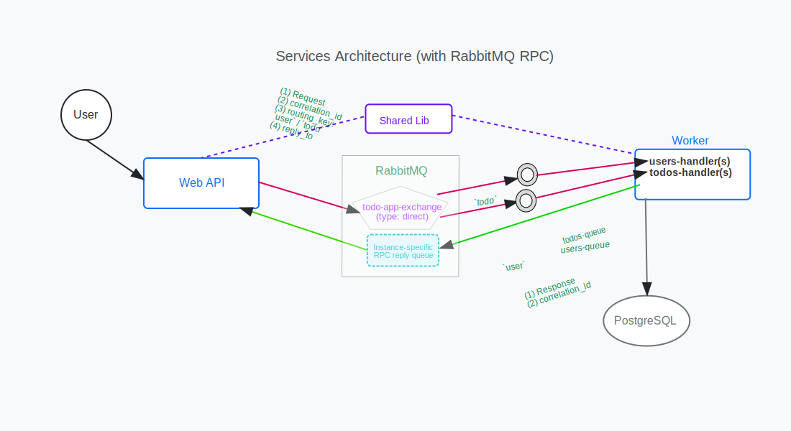

# Todo Application

A backend-only (starter) Todo application with separate Web API and Worker services, using RabbitMQ for communication and PostgreSQL for data storage.

RabbitMQ carries request-response (RPC) traffic rather than fire-and-forget messages — the REST caller expects the created entity in the HTTP response, so the Web API blocks on the Worker Service's reply — which buys decoupling and durability without making the API asynchronous.

**Contents:** [Functional Requirements](docs/requirements.md) · [Architecture](docs/architecture.md) · [Getting Started](#getting-started)

## Functional Requirements

The REST APIs, entity model, service split, and Docker Compose deliverables the application is built to satisfy are listed in [docs/requirements.md](docs/requirements.md).

## Architecture

The Web API delegates every request to the Worker Service over a RabbitMQ RPC pattern, and the Worker Service is the only writer to PostgreSQL. The messaging flow, database schema, threading model, and scalability measurements are described in [docs/architecture.md](docs/architecture.md): 

<a href="docs/architecture.md"></a>

## Getting Started

### Prerequisites

- Docker and Docker Compose

The services compile inside the .NET 8.0 SDK image during the Docker build, so a host .NET SDK is
needed only to build or edit `src/TodoApp.sln` outside Docker.

To start the application:

```bash
# Start the application (WSL/Linux)
./scripts/start.sh
```

The following services will be available:

- WebAPI service ([http://localhost:5000](http://localhost:5000))
- Worker service(s)
- RabbitMQ (available on localhost:**5672**) and Management UI ([http://localhost:15672](http://localhost:15672))
- PostgreSQL (database name: **tododb**), reachable only from the compose network. To open a shell
  against it: `docker compose -p todo-app exec postgres psql -U postgres -d tododb`

### Load testing

With the application running, drive load against it using the JMeter test plans in `jmeter/`. If
`jmeter` is not on your PATH, the helper downloads and installs it locally (only Java is required).

```bash
# Minimal: 2 threads * 5 loops = 10 requests (the default)
./scripts/jmeter-helper.sh

# Long: 200 threads * 250 loops = 50,000 requests
./scripts/jmeter-helper.sh --long
```

By default only JMeter's console summary is printed; pass `--jtl` to also write per-request
results to `jmeter/results-<mode>.jtl`. See
[deploy/README.md](deploy/README.md#jmeter-load-testing) for what each plan exercises and what to
expect in the database.

To stop the application:

```bash
./scripts/docker-helper.sh --stop

# Optional: also remove volumes (will delete local postgres data)
./scripts/docker-helper.sh --stop --volumes
```

`docker-helper.sh` also tails the stack's logs (`--logs`, with severity and service filters) and
shows container status (`--ps`); see `./scripts/docker-helper.sh --help`.
