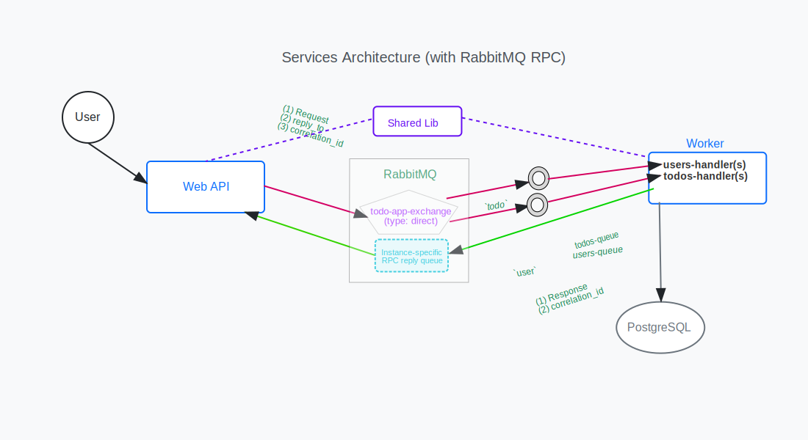

# Todo Application

## Table of Contents

<!-- toc -->

- [Task Overview:](#task-overview)
  * [Requirements:](#requirements)
  * [Technologies:](#technologies)
  * [Deliverables:](#deliverables)
- [Architecture](#architecture)
- [Prerequisites](#prerequisites)
- [Running the Application](#running-the-application)
- [Project Structure](#project-structure)
- [Features](#features)

<!-- tocstop -->

## Task Overview:

Implement a backend-only To-Do application. Swagger will serve as the client interface for this task.

### Requirements:

1. Implement RESTful APIs for managing both User and Item entities.
2. A User can have multiple Items (one-to-many relationship).
3. Design the models using a minimal set of fields necessary for the task.
4. Soft delete should be implemented for deleting an item.
5. Use Entity Framework (EF) with the Code-First approach.
6. Create two separate services:

- Web Service:
  - Exposes the APIs using Swagger.
  - Handles only input validation and verification logic.
- Worker Service:
  - Consumes messages from the web service.
  - Responsible for persisting data to the database.

7. Communication between the services should be handled via RabbitMQ.

### Technologies:

- Database: PostgreSQL (use any managed solution you&#39;re comfortable with)
- Message Broker: RabbitMQ (also managed or local, as preferred)

Focus on designing a clean and minimal database schema and defining a robust communication pattern with RabbitMQ (e.g.queue types, policies, error handling, etc.).

### Deliverables:

- A Docker Compose file that brings up:
  - The web service
  - The worker service
  - PostgreSQL
  - RabbitMQ
- The Docker Compose setup should allow for running and testing the entire system locally with minimal configuration.
- Code should follow best practices and clean architecture principles as much as possible.

## Architecture

See the diagram for how the topic exchange routes messages to Workers' queues based on routing patterns, while temporary reply queues handle RPC responses.



This application uses RabbitMQ's Topic Exchange pattern with RPC (Remote Procedure Call) for communication between the Web API and Worker services. Messages are published to a topic exchange (`todo-app-exchange`) with specific routing keys (e.g., `user.created`, `todo.updated`), and the Worker Service binds its queues to patterns (`user.*` and `todo.*`) to receive relevant messages. Each request includes a temporary reply queue and correlation ID for RPC communication, enabling the Worker to process requests and send responses back to the Web API.

**Why use RabbitMQ RPC?**

- Extends the user-to-WebAPI request/response pattern by enabling similar synchronous-style communication between the WebAPI and Worker services, while maintaining the benefits of message-based decoupling.
- Supports service decoupling, reliability, and load distribution.
- Useful when you need guaranteed delivery, offline resilience, or want to avoid direct HTTP dependencies between services.

**How it works:**

1. The Web API publishes a message (e.g., `CreateUserMessage`) to the topic exchange with a specific routing key (e.g., `user.created`), along with `reply_to` queue and `correlation_id`.
2. The Worker's queues, bound to the topic patterns (`user.*`, `todo.*`), receive matching messages. The Worker processes the request and sends a response to the `reply_to` queue.
3. The Web API waits for and receives the response on its temporary queue, matching it by `correlation_id`.

**Tradeoffs:**

- More complex than simple publish/subscribe: requires managing temp queues, correlation IDs, and timeouts.
- Not as easy to trace/debug as RESTful APIs.

**When to use:**

- When you need request-response over queues, want to decouple services, or require reliable delivery and load distribution.

**When not to use:**

- If you need low-latency, real-time synchronous responses.

## Prerequisites

- Docker and Docker Compose
- .NET 9.0 SDK (for development)

## Running the Application

Run the following script to check dependencies and start the application:

```powershell
.\start-todo-app.ps1
```

The following services will be available:

- [WebAPI](http://localhost:5000) (available on localhost:**5000**)
- RabbitMQ (available on localhost:**5672**) and [Management UI](http://localhost:15672) (available on localhost:**15672**)
- PostgreSQL (available on localhost:**5432**)

## Project Structure

- `src/TodoApp.WebApi`: Web API service with Swagger UI
- `src/TodoApp.WorkerService`: Background worker service for data persistence
- `src/TodoApp.Shared`: Shared models and message contracts

## Features

- RESTful APIs for User and Todo Item management
- Soft delete implementation for Todo Items
- Entity Framework Core with Code-First approach
- RabbitMQ message-based communication between services
- Swagger UI for API documentation and testing
