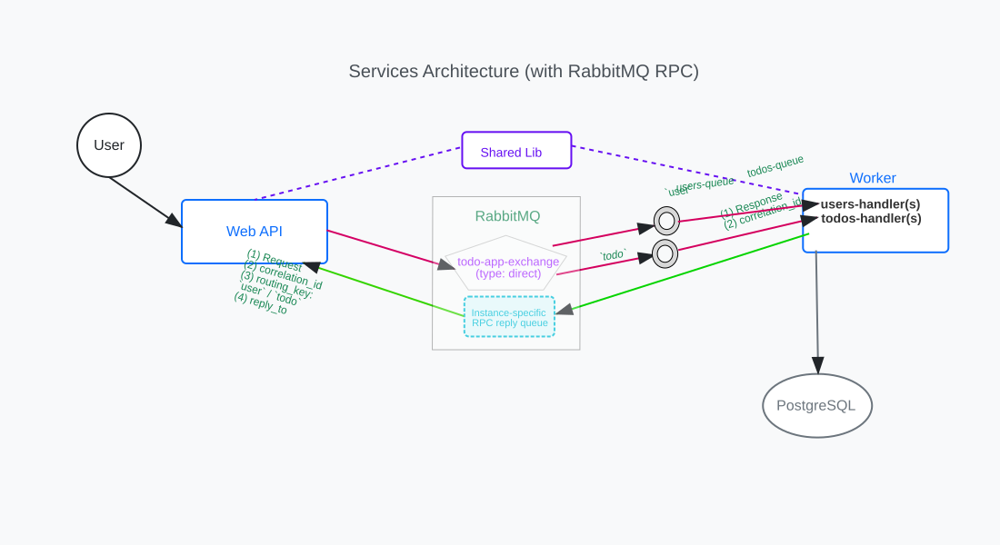

# Architecture

Every REST call the WebAPI accepts becomes a message: routed through a durable direct exchange to
a durable queue, processed by one of the Worker Service replicas — the only writer to a minimal
PostgreSQL schema — and answered on the calling instance's reply queue matched by correlation ID,
with worker errors returned as typed RPC error responses. Every request takes effect **exactly
once**, even under client retries or broker redelivery ([Idempotency](#idempotency)). The
[communication pattern](#communication-pattern) below walks through this flow step by step.

## When is RabbitMQ RPC worth it?

The REST caller expects the operation's result in the HTTP response, so the services need
request-response semantics — but carrying that traffic over RabbitMQ instead of a direct HTTP call
buys broker-mediated durability and competing-consumer scaling at the cost of extra moving parts:

| Factor                 | Direct HTTP call                                            | RabbitMQ RPC (this project)                                                             | Fire-and-forget messaging                            |
| ---------------------- | ----------------------------------------------------------- | --------------------------------------------------------------------------------------- | ---------------------------------------------------- |
| Response to caller     | Native                                                      | Reply queue + correlation ID                                                             | None — results must be fetched separately            |
| Simplicity             | Simplest: one call, one stack trace                         | Broker, exchange, queues, and correlation IDs to configure and debug                     | Broker plumbing, but no reply path                   |
| Durability             | None — an in-flight request is lost if the callee is down   | Requests persist in durable queues across worker and broker restarts                     | Same durable-queue guarantee                         |
| Horizontal scalability | Requires a load balancer or service discovery               | Add worker replicas; the broker load-balances the shared queue across competing consumers | Same competing-consumer scaling                      |
| Load leveling          | Bursts hit the callee directly                              | The queue absorbs bursts; workers drain at their own pace, bounded by the RPC timeout    | Queue absorbs bursts with no timeout pressure        |
| Temporal coupling      | Both sides must be up simultaneously                        | The worker can restart mid-burst without losing requests; the caller still awaits a reply | None — producer and consumer fully independent       |
| Latency                | Lowest                                                      | Two broker hops per call                                                                 | Not applicable — no reply                            |
| Failure handling       | Errors surface immediately to the caller                    | At-least-once delivery: handlers must be idempotent; failed messages dead-letter for replay | At-least-once, but failures are invisible to the producer |

Choose RabbitMQ RPC when the caller needs the result synchronously **and** durability,
load leveling, or competing-consumer scaling matters. Choose a direct HTTP call when latency and
simplicity dominate and both services are reliably available. Choose fire-and-forget messaging
when the caller does not need a result at all. How this codebase implements the reply path and
delivery guarantees is detailed in
[Trade-offs & implementation notes](#trade-offs--implementation-notes-what-to-pay-attention-to).

## Project Structure

- [`src/TodoApp.WebApi`](../src/TodoApp.WebApi): Web API service with Swagger UI ([http://localhost:5000/swagger](http://localhost:5000/swagger))
- [`src/TodoApp.WorkerService`](../src/TodoApp.WorkerService): Background worker service for data persistence
- [`src/TodoApp.Shared`](../src/TodoApp.Shared): Shared models and message contracts

## RabbitMQ

### Communication Pattern

This application uses RabbitMQ's Direct Exchange with RPC (Remote Procedure Call) for communication between the Web API and Worker services. The flow is:

1.  The WebApi [publishes a messages](../src/TodoApp.WebApi/Services/RabbitMQMessageService.cs) (`PublishMessageRpc`) to the exchange, with [a specific routing key](../src/TodoApp.Shared/Configuration/RabbitMQ/RoutingKeys.cs) and a unique correlation ID

2.  The Worker Service:

    2.1. [Binds its queues to these routing keys](../src/TodoApp.WorkerService/Helpers/RabbitMQSetup.cs) and receives relevant messages.
    - The worker runs as multiple Docker `replicas` that all consume from the same queue(s) as **competing consumers**: each message is delivered to **one** replica (load-balanced by RabbitMQ, optionally influenced by prefetch).

    - Each request takes effect **exactly once**. The broker can deliver the same message more than once — a consumer that crashes or disconnects before acking gets it **redelivered** — so [Idempotency](#idempotency) deduplicates the repeat: a redelivered or retried request never writes twice and returns the original result.

    2.2. Processes each request and sends back a response to the request's `reply_to` queue, [including the original correlation ID](../src/TodoApp.WorkerService/Services/BaseMessageHandler.cs) (`SendRpcResponse`)

3.  The WebApi:

    3.1. Uses the [correlation ID to locate the pending request](../src/TodoApp.WebApi/Services/RabbitMQMessageService.cs) (`consumer.Received +=`) and completes it when a reply is received on the `reply_to` queue

    3.2. [Deserializes the reply and returns a typed result](../src/TodoApp.WebApi/Controllers/BaseApiController.cs) (`ExecuteRpc`) to the REST API consumer — camelCase JSON on success, RFC 7807 ProblemDetails on error

**Key Concepts**

- **Exchange**: A direct exchange `todo-app-exchange` routes each message to one queue by its routing key (`user` -> users queue, `todo` -> todos queue) — the app needs fixed 1:1 routing, not broadcast or pattern matching
- **Queues**: Two dedicated queues for handling user and todo operations respectively
- **Reply Queues & Correlation IDs**: All RPC requests from one WebApi instance share a single exclusive reply queue and unique correlation ID to track responses (see [Trade-offs & implementation notes](#trade-offs--implementation-notes-what-to-pay-attention-to))

### Error Handling & Reliability

- Durable exchange/queue declarations plus persistent request publishing (`properties.Persistent` in [RabbitMQMessageService.cs](../src/TodoApp.WebApi/Services/RabbitMQMessageService.cs)) preserve queued requests across broker restarts
- Requests that fail processing are rejected without requeue and routed through a dead-letter exchange to a durable `dead-letter-queue` ([RabbitMQSetup.cs](../src/TodoApp.WorkerService/Helpers/RabbitMQSetup.cs)) for inspection and replay, instead of being discarded by the broker
- Error handling with message acknowledgment ([BaseMessageHandler.cs](../src/TodoApp.WorkerService/Services/BaseMessageHandler.cs)): each delivery is settled exactly once — acked after successful processing, nacked to the dead-letter queue on failure — before the RPC reply is published
- Connection retries with exponential backoff at startup ([Connections.cs](../src/TodoApp.Shared/Configuration/RabbitMQ/Connections.cs)); after startup, RabbitMQ.Client's automatic connection and topology recovery (enabled by default in 6.x) restores the connection, its channels, the named exclusive reply queue, and its consumer if the connection drops mid-run. Requests in flight during an outage are not replayed — their replies are lost, and each pending call completes through the RPC timeout path below.
- Timeout handling for RPC calls ([RabbitMQMessageService.cs](../src/TodoApp.WebApi/Services/RabbitMQMessageService.cs): configurable via `WebApi__RpcTimeoutSeconds`, 5 seconds by default). The 503 returned on timeout is safe to retry: the retry carries the same idempotency key, so the worker replays the original outcome instead of writing again (see [Idempotency](#idempotency)).

### Idempotency

Every write takes effect exactly once, even though the worker can receive the same request more than
once — RabbitMQ resends a message when a worker crashes before acknowledging it, and an HTTP caller
may retry. One mechanism deduplicates both.

- **One key per write, supplied or derived.** A write is identified by its `Idempotency-Key` header,
  or — when the caller sends none — by a key the WebApi derives from the request's content. The key is
  the same across an HTTP retry and a broker redelivery, so it names the same request on both. A
  caller-supplied key wins: a derived key treats two identical writes as one, so a caller that means
  them as distinct sends its own keys. Reads carry no key.
- **One transactional marker.** The worker records each write as a row in `ProcessedMessages`, keyed
  by the idempotency key and committed in the same transaction as the write
  ([BaseMessageHandler.cs](../src/TodoApp.WorkerService/Services/BaseMessageHandler.cs)) — so a
  marker's presence proves the write happened. A first-time write just inserts its marker; a
  duplicate's insert hits the existing key, and the worker reads the marker to replay the original
  reply instead of writing again, or rejects the request if the same key arrives with a different
  body. Two replicas racing on a redelivery resolve the same way: one wins, the other replays.
- **Bounded storage.** Markers matter only during the redelivery/retry window; a background sweep
  ([ProcessedMessageCleanupService.cs](../src/TodoApp.WorkerService/Services/ProcessedMessageCleanupService.cs))
  runs once daily at an off-peak UTC hour (02:00 by default) and deletes markers past their
  retention age (10 minutes). Because the sweep is daily, a marker persists until that day's sweep
  rather than the moment it ages out — the retention age is the minimum lifetime, not the maximum.
  Both settings live in the `Idempotency` config section (appsettings.json or `Idempotency__*`
  environment variables).

### Trade-offs & implementation notes (what to pay attention to)

- Reply queue design:
  - Each WebApi instance creates one named, exclusive, auto-delete reply queue at startup ([RabbitMQMessageService.cs](../src/TodoApp.WebApi/Services/RabbitMQMessageService.cs)), instead of a temporary queue per request
  - A single long-lived consumer serves all in-flight requests, avoiding per-request queue/consumer churn
  - Correlation IDs route responses to the correct pending request within the instance
  - The reply queue is deliberately not durable: pending requests live only in the instance's memory, so a reply queue that outlived its instance or a broker restart could never deliver to anyone — the broker removes the queue when the instance's connection closes, so restarts leave nothing behind

## PostgreSQL

### Schema Design

The application uses a clean, normalized database schema implemented in PostgreSQL, defined
Code-First with [Entity Framework Core](https://learn.microsoft.com/en-us/ef/core/managing-schemas/migrations/):
the schema lives in C# models and configuration, and the Worker Service applies it to the database
via migrations. See [Models/](../src/TodoApp.Shared/Models/), [Migrations/](../src/TodoApp.WorkerService/Migrations/), and [TodoDbContext.cs](../src/TodoApp.WorkerService/Data/TodoDbContext.cs)

**Deletion model:** deleting a todo item is a soft delete (`IsDeleted` flag), so an item remains
recoverable while its owner exists. Deleting a user is a hard delete that cascade-removes all of the
user's todo items, soft-deleted ones included — todo history is scoped to its owner's lifetime, and
orphaned history for a nonexistent user has no value.

### Startup

The worker service ensures database availability before processing messages:

1. [DbInitializationService](../src/TodoApp.WorkerService/Services/DbInitializationService.cs) probes the database with exponential backoff, then runs pending migrations
2. [Message handlers](../src/TodoApp.WorkerService/Services/BaseMessageHandler.cs) wait for an [DbInitializationSignal](../src/TodoApp.WorkerService/Services/DbInitializationSignal.cs) before consuming messages
3. Once database is ready, the signal is triggered and handlers start processing

## Threading Model

**WebAPI Service:**

- Each HTTP request runs on its own thread-pool thread (ASP.NET Core's default).
- One background thread consumes the reply queue ([RabbitMQMessageService.cs](../src/TodoApp.WebApi/Services/RabbitMQMessageService.cs)). It hands each reply back to the request waiting for it by matching the correlation ID against a `ConcurrentDictionary` of pending requests — the one place the many request threads and that single reply thread meet, so the map has to be concurrent.
- Publishing borrows a channel from a pool (`ObjectPool<IModel>`) so two requests never write to the same channel at once.
- Publishes go out on one RabbitMQ connection and replies arrive on a second ([Program.cs](../src/TodoApp.WebApi/Program.cs)), so a burst of publishes cannot delay reply deliveries by hogging a shared socket. Each connection has its own health check (`rabbitmq-publish`, `rabbitmq-consume`).

**Worker Service:**

- One `UserMessageHandler` and one `TodoItemMessageHandler`, each consuming its own queue on its own channel ([Program.cs](../src/TodoApp.WorkerService/Program.cs)). More throughput comes from running more replicas, not more threads per process (see [Scalability notes](#scalability-notes)).
- Each message is handled with its own `DbContext` from a fresh scope ([UserMessageHandler.cs](../src/TodoApp.WorkerService/Services/UserMessageHandler.cs), [TodoItemMessageHandler.cs](../src/TodoApp.WorkerService/Services/TodoItemMessageHandler.cs)), because one `DbContext` cannot serve two messages at the same time.
- Handlers hold off consuming until the database is migrated, waiting on [DbInitializationSignal](../src/TodoApp.WorkerService/Services/DbInitializationSignal.cs).

## Scalability notes

The worker scales horizontally: the compose files set `services.worker.deploy.replicas` (the
local compose reads it from the `WORKER_REPLICAS` environment variable), and every replica
consumes the same durable queues as a competing consumer, so RabbitMQ load-balances messages
across replicas. Raising the replica count is the scaling lever; each handler consumes with
`prefetchCount: 5`, so a replica keeps a few deliveries staged locally and does not wait a broker
round-trip between messages, while the low cap keeps work spread across replicas.
[`scripts/optimize-replicas-count.sh`](../scripts/optimize-replicas-count.sh) searches for the
best count for the host machine.

Each replica runs pending EF migrations at startup, serialized by a Postgres advisory lock
([DbInitializationService.cs](../src/TodoApp.WorkerService/Services/DbInitializationService.cs)):
on a fresh database, one replica migrates while the rest wait on the lock, then find nothing pending.
This keeps concurrently starting replicas from racing to apply the same migrations.

Scalability under load can be exercised with the JMeter test plans; see
[Load Testing](load-testing.md).
